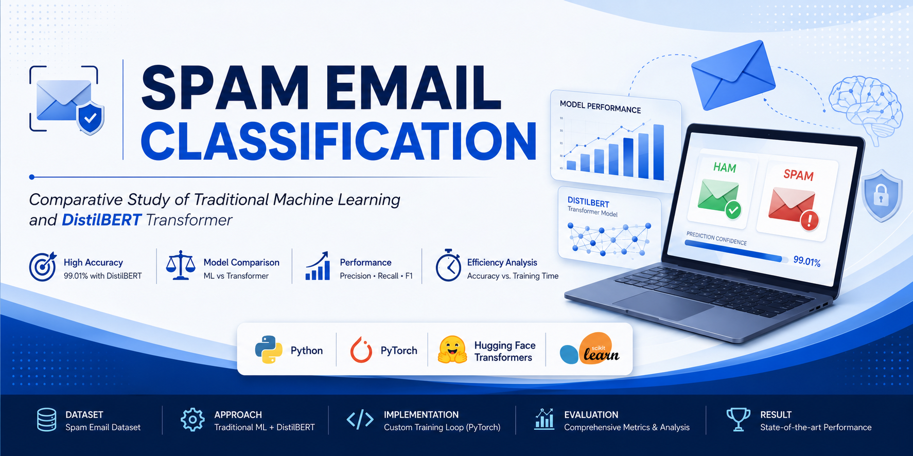
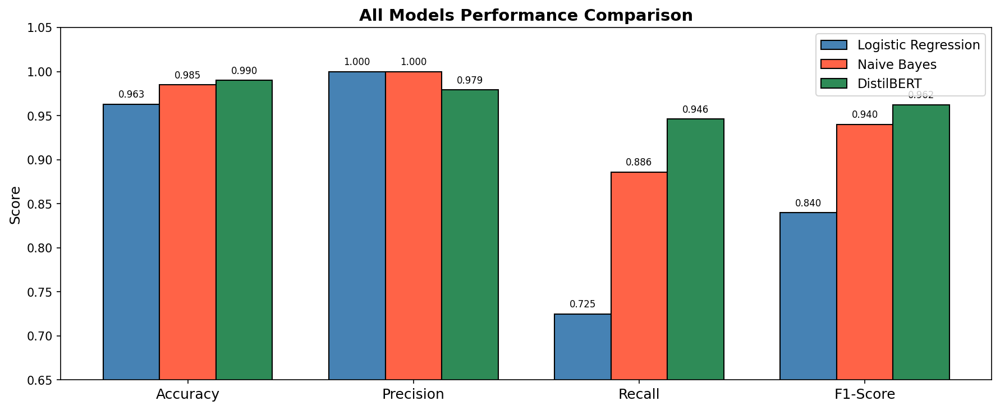
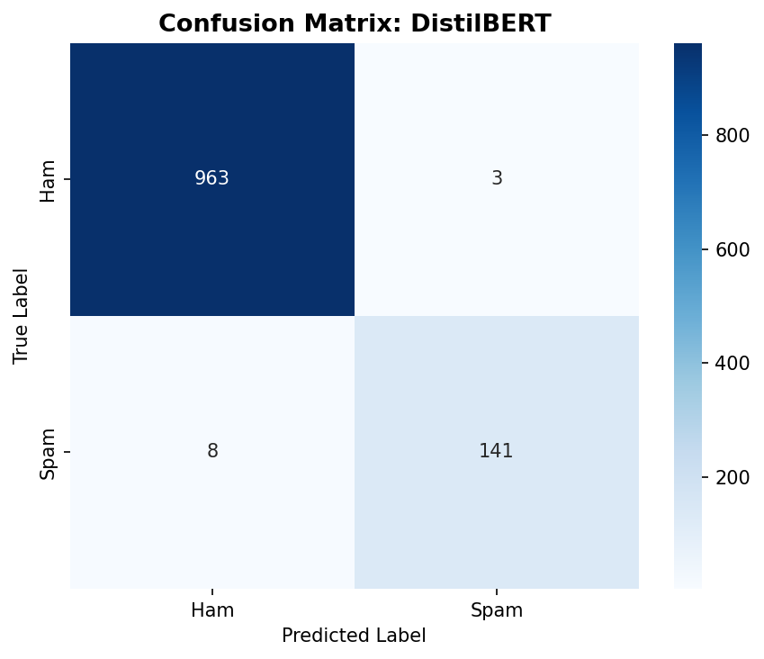
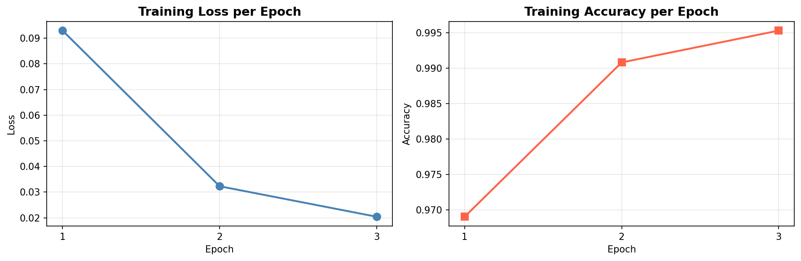

<p align="center">
  
</p>
# Spam Email Classification using Traditional Machine Learning and DistilBERT

## Overview

This project presents a comparative study of traditional Machine Learning algorithms and a Transformer-based deep learning model for spam email classification. The objective is to evaluate the trade-offs between classical feature engineering techniques and contextual language understanding provided by modern transformer architectures.

The implementation consists of two independent approaches:

- **Part A:** Traditional Machine Learning using TF-IDF with Logistic Regression and Multinomial Naive Bayes.
- **Part B:** Transformer-based spam classification using DistilBERT with a custom PyTorch training loop (without using Hugging Face Trainer API).

The project was developed in Python as part of an academic assignment to analyze model performance, computational efficiency, and classification effectiveness.

---
## Project Results

### Model Performance Comparison



### DistilBERT Confusion Matrix



### Training Curves



## Objectives

- Classify emails into **Spam** and **Ham**.
- Compare traditional Machine Learning models with a Transformer-based model.
- Evaluate model performance using multiple classification metrics.
- Analyze computational cost and training behavior.
- Visualize experimental results through informative plots.

---

## Dataset

**Dataset:** Spam Email Classification Dataset

The dataset contains labeled email messages belonging to two classes:

- **Ham** (Legitimate Emails)
- **Spam** (Unwanted Emails)

Before model development, the dataset was cleaned, analyzed, and split into training and testing sets using stratified sampling.

---

## Project Structure

```
spam-email-classification/
│
├── data/
│   └── email.csv
│
├── plots/
│   ├── all_models_comparison.png
│   ├── confusion_matrices_partA.png
│   ├── confusion_matrix_partB.png
│   ├── eda_distribution.png
│   ├── metric_comparison.png
│   ├── training_curves_partB.png
│   ├── training_time_all.png
│   └── training_time_partA.png
│
├── part_a.py
├── part_b.py
├── requirements.txt
└── README.md
```

---

## Technologies Used

- Python
- PyTorch
- Hugging Face Transformers
- Scikit-learn
- Pandas
- NumPy
- Matplotlib
- Seaborn

---

# Part A – Traditional Machine Learning

### Workflow

- Data Cleaning
- Text Preprocessing
- TF-IDF Vectorization
- Logistic Regression
- Multinomial Naive Bayes
- Performance Evaluation

### Models Implemented

- Logistic Regression
- Multinomial Naive Bayes

### Evaluation Metrics

- Accuracy
- Precision
- Recall
- F1-Score
- Confusion Matrix

---

# Part B – DistilBERT Transformer

The second implementation uses the pre-trained **DistilBERT** model from Hugging Face.

Unlike high-level APIs, this implementation includes a fully customized PyTorch training loop.

### Implementation Highlights

- DistilBERT Tokenizer
- Custom PyTorch Dataset
- DataLoader
- Fine-tuning DistilBERT
- Layer Freezing Strategy
- AdamW Optimizer
- Gradient Clipping
- Manual Training Loop
- Evaluation without Trainer API

---

## Experimental Results

| Model | Accuracy | Precision | Recall | F1-Score |
|-------|----------:|----------:|--------:|----------:|
| Logistic Regression | **96.30%** | **100.00%** | **72.50%** | **84.00%** |
| Naive Bayes | **98.50%** | **100.00%** | **88.60%** | **94.00%** |
| **DistilBERT** | **99.01%** | **97.92%** | **94.63%** | **96.25%** |

---

## Visualizations

The project includes:

- Dataset Class Distribution
- Confusion Matrices
- Training Loss Curve
- Training Accuracy Curve
- Model Performance Comparison
- Training Time Comparison

---

## Key Observations

- DistilBERT achieved the highest overall classification performance.
- Traditional Machine Learning models required significantly less training time.
- Logistic Regression achieved perfect precision but lower recall.
- Naive Bayes demonstrated an effective balance between speed and accuracy.
- DistilBERT captured contextual information more effectively, resulting in superior recall and F1-score.

---

## Limitations

- Transformer models require substantially higher computational resources.
- Training time increases significantly on CPU-only systems.
- Fine-tuning large language models is memory intensive.
- Results may vary depending on hyperparameter selection and dataset characteristics.

---

## Future Improvements

- Hyperparameter optimization
- Learning rate scheduling
- Early stopping
- Cross-validation
- Deployment using Flask or FastAPI
- Web interface for real-time spam detection

---

## Installation

Clone the repository:

```bash
git clone https://github.com/IbraheemInsights/spam-email-classification.git
```

Move into the project directory:

```bash
cd spam-email-classification
```

Install dependencies:

```bash
pip install -r requirements.txt
```

---

## Running the Project

Traditional Machine Learning:

```bash
python part_a.py
```

Transformer Model:

```bash
python part_b.py
```

---

## Author

**Mohammad Abdul Ibraheem**

B.Tech – Electronics and Communication Engineering

Guru Nanak Institutions Technical Campus

Hyderabad, India

---

## License

This project is intended for educational and research purposes.
